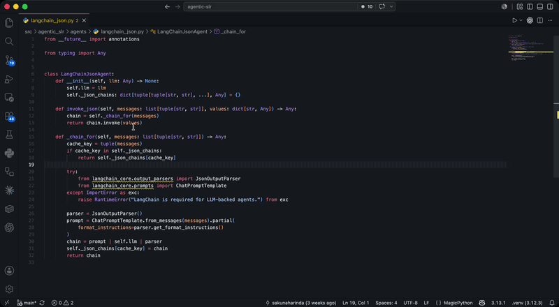

# Clarify

AI-powered code explanations, inline in your editor. Highlight any code, press **Shift+E**, and get a structured explanation generated by OpenAI or Claude — without leaving VS Code.

## Features

**Inline ghost text** — a one-line summary appears at the end of your selection as the AI generates it, updating live as tokens stream in.

**Rich hover card** — hover over the highlighted code to see the full structured explanation:
- Summary
- Parameter descriptions (name, type, purpose)
- Return value
- Edge cases and gotchas

**Insert as comment** — click **Insert as comment** in the hover card, or right-click the selection and choose **Clarify: Insert Explanation as Comment**, to permanently add a language-appropriate block comment above the selection.

**File context awareness** — Clarify automatically includes the surrounding code (up to `clarify.contextLines` lines, default 50) when sending your selection to the AI. The model sees what comes before and after, so it can explain a function in terms of how it's actually called, what data flows through it, and what the broader module is doing — not just the snippet in isolation.

**Multi-provider** — use OpenAI (GPT-4o, GPT-4o Mini, GPT-4 Turbo, GPT-3.5 Turbo) or Anthropic (Claude Opus 4.8, Sonnet 4.6, Haiku 4.5). Switch providers at any time from settings.

**Streaming responses** — the ghost text updates character-by-character as the explanation is generated, so you see progress immediately and long explanations never time out.

**Works in any language** — Python, TypeScript, JavaScript, Java, C/C++, C#, Go, Rust, Ruby, SQL, Lua, Shell, and more. Comment style adapts automatically (JSDoc for JS/TS, `#` for Python, `--` for SQL, etc.).

## Requirements

An API key for your chosen provider:
- **OpenAI**: an [OpenAI API key](https://platform.openai.com/api-keys) (`sk-...`)
- **Anthropic**: an [Anthropic API key](https://console.anthropic.com/) (`sk-ant-...`)

## Setup

1. Open the Command Palette (`Ctrl+Shift+P` / `Cmd+Shift+P`) and run **Clarify: Open Settings**.
2. Set `clarify.provider` to `openai` or `claude`.
3. Paste your API key into `clarify.openaiApiKey` or `clarify.anthropicApiKey`.
4. Optionally pick a model and adjust `clarify.contextLines`.

## Usage

1. Select at least one full line of code in the editor.
2. Press **Shift+E** — the ghost text updates live as the explanation streams in.
3. Hover over the selection to read the full explanation.
4. Click **Insert as comment** in the hover to add it permanently above the selection.

To change the keybinding: open **Keyboard Shortcuts** (`Ctrl+K Ctrl+S`), search for `Clarify: Explain Selected Code`, and assign your preferred key.

## Extension Settings

| Setting | Default | Description |
|---|---|---|
| `clarify.provider` | `openai` | AI provider: `openai` or `claude`. |
| `clarify.openaiApiKey` | `""` | Your OpenAI API key. Stored as plain text in `settings.json`. |
| `clarify.model` | `gpt-4o` | OpenAI model. Options: `gpt-4o`, `gpt-4o-mini`, `gpt-4-turbo`, `gpt-3.5-turbo`. |
| `clarify.anthropicApiKey` | `""` | Your Anthropic API key. Stored as plain text in `settings.json`. |
| `clarify.claudeModel` | `claude-opus-4-8` | Claude model. Options: `claude-opus-4-8`, `claude-sonnet-4-6`, `claude-haiku-4-5-20251001`. |
| `clarify.contextLines` | `50` | Lines of surrounding file content sent as context. Set to `0` to send only the selection. |

## Commands

| Command | Default keybinding |
|---|---|
| Clarify: Explain Selected Code | `Shift+E` (when text is selected) |
| Clarify: Insert Explanation as Comment | — (also in right-click menu) |
| Clarify: Open Settings | — |

## Known Issues

- The `Shift+E` keybinding intercepts the normal behaviour of typing `E` to replace a selection. If this conflicts with your workflow, rebind the command to something like `Alt+Shift+E`.
- API keys are stored as plain text in VS Code's `settings.json`. Avoid committing that file to source control if it contains your key.
